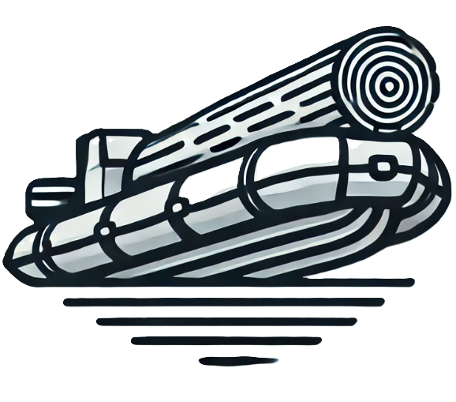

<!-- Improved compatibility of back to top link: See: https://github.com/othneildrew/Best-README-Template/pull/73 -->

<a name="readme-top"></a>

<!-- PROJECT LOGO -->
<br />
<div align="center">
  <a href="LINK"><!-- TODO: add when hosted -->
    
  </a>

  <h3 align="center">ToDo List</h3>

  <p align="center">
    Website to keep track of all your todos.
    <br />
    <!-- TODO: add when hosted -->
    <!-- <a href="LINK">View Site</a> -->
  </p>

  <!-- TODO: add when hosted -->
  <!-- <p>
    <sup>Deployment status:</sup>
    <a href="https://app.netlify.com/sites/tahuyarivervalleywaterdistrict/deploys?branch=main">
      
    </a>
  </p> -->
</div>

<!-- TABLE OF CONTENTS -->
<details>
  <summary>Table of Contents</summary>
  <ol>
    <li>
      <a href="#about-the-project">About The Project</a>
      <ul>
        <li><a href="#built-with">Built With</a></li>
      </ul>
    </li>
    <li><a href="#usage">Usage</a></li>
    <li><a href="#optimizations">Optimizations</a></li>
    <li><a href="#lessons-learned">Lessons Learned</a></li>
    <li><a href="#contact">Contact</a></li>
    <li><a href="#acknowledgments">Acknowledgments</a></li>
  </ol>
</details>

<!-- ABOUT THE PROJECT -->

## About The Project

<p align="center">
    <a href="LINK"><!-- TODO: add when hosted -->
      
    </a>
</p>

Created using the MVC architecture, this todo list application allows users to sign up, log in, and create, read, update, and delete their very own todos!

<p align="right">(<a href="#readme-top">back to top</a>)</p>

### Built With

- 
- 
- 
- 
- 
- 
- 
- 

<p align="right">(<a href="#readme-top">back to top</a>)</p>

<!-- USAGE -->

## Usage

Getting started is as easy as 1-2-3:

1. Visit the [homepage](LINK)<!-- TODO: add when hosted -->
1. Click `signup`
   - Create your account by signing up using your email and creating a password
1. Start adding things to do!

<p align="right">(<a href="#readme-top">back to top</a>)</p>

<!-- OPTIMIZATIONS -->

## Optimizations

This project can be improved by:

- [ ] Adding strategies to allow users to sign up and sign in using a provider
- [x] ~~Hiding the todos paper container when the user has finished all todos~~
- [ ] Showing the active page on the navbar
- [ ] Streamlining CSS
- [x] ~~Moving the passing of the user from `server.js` to its own middleware~~
- [ ] Fix how error messages show up for the user when incorrectly filling out forms

<p align="right">(<a href="#readme-top">back to top</a>)</p>

<!-- LESSONS LEARNED -->

## Lessons Learned

1. **MVC Architecture**

   1. **Separation of Concerns**

      - Learned to keep business logic in controllers instead of writing logic inside routes or views.
      - Improved code readability by ensuring models only define data structure and controllers handle CRUD operations.
      - Understood that views (EJS templates) should remain lightweight, mainly responsible for rendering dynamic content.

   1. **Model Layer – Structuring Mongoose Models Efficiently**

      - Improved schema design by defining fields, default values, and validation in Mongoose models.
      - Learned how to structure models for authentication (User model) vs. application data (Todo model).
      - Used Mongoose methods & statics for reusable database queries (e.g., finding todos by user ID).

   1. **Controller Layer – Keeping Business Logic Organized**

      - Understood that controllers should handle requests & responses rather than routes doing everything.
      - Improved error handling by wrapping database calls in `try/catch` blocks.
      - Used `async/await` effectively for database interactions instead of nesting `.then()` calls.

      Example of cleaner controller logic:

      ```js
      exports.createTodo = async (req, res) => {
        try {
          await Todo.create({
            todo: req.body.todoItem,
            completed: false,
            user: req.user.id,
          });
          res.redirect('/todos');
        } catch (err) {
          console.error(err);
          res.status(500).send('Server Error');
        }
      };
      ```

   1. **View Layer – Dynamic Rendering with EJS**

      - Leveraged EJS loops (<% todos.forEach( el => { %>) to dynamically render lists.
      - Used partials (`head.ejs`, `navbar.ejs`, etc.) for reusable components, reducing duplicate code.
      - Improved UI by conditionally rendering elements based on authentication state (if user is logged in, show Logout button).

   1. **Route Layer – Keeping Routes Clean & Modular**

      - Moved route handlers to controllers for better organization.
      - Used Express middleware (`ensureAuthenticated`) to protect routes properly.
      - Applied RESTful route naming conventions (e.g., `GET /todos` for fetching, `POST /todos` for creating, etc.).

      Example of refactored routes using a controller:

      ```js
      const express = require('express');
      const router = express.Router();
      const todosController = require('../controllers/todos');
      const { ensureAuthenticated } = require('../middleware/auth');

      router.get('/', ensureAuthenticated, todosController.getTodos);
      router.post(
        '/createTodo',
        ensureAuthenticated,
        todosController.createTodo
      );
      router.delete(
        '/deleteTodo/:id',
        ensureAuthenticated,
        todosController.deleteTodo
      );

      module.exports = router;
      ```

   1. **Middleware – Improving Code Reusability**

      - Used middleware to centralize authentication logic instead of checking in every route.
      - Understood the middleware execution order (e.g., authentication runs before protected routes).

      Example:

      ```js
      module.exports = {
        ensureAuthenticated: (req, res, next) => {
          if (req.isAuthenticated()) {
            return next();
          }
          res.redirect('/login');
        },
      };
      ```

   1. **Benefits of the MVC Pattern**
      - _Scalability_ – Adding new features is easier because of the clear separation of concerns.
      - _Maintainability_ – Debugging is simpler since logic is divided into models, views, and controllers.
      - _Code Reusability_ – Middleware, controllers, and models can be reused without duplication.

1. **Full-Stack Authentication Workflow**

   - Gained experience with Passport.js for local authentication (session-based).
   - Understood the flow of user registration, login, logout, and session management.
   - Debugged authentication issues, such as incorrect session persistence or middleware order affecting login states.

1. **EJS & Express Backend Refinements**

   - Improved how EJS templates dynamically render content based on user authentication.
   - Used partials (`head.ejs`, `navbar.ejs`, `footer.ejs`) for better reusability.
   - Ensured better form handling and validation for user inputs.

1. **Dynamic Frontend & Styling Enhancements**

   - Styled the todo list dynamically so that `.paperContainer` and `.paperContent` resize properly based on the number of todos.
   - Added scrolling behavior when the list grows too long, ensuring a clean UI.
   - Improved CSS organization with flexbox, grid, and responsive design principles.

1. **RESTful API & Express Routes**

   - Optimized how CRUD operations interact with the database.
   - Learned how routes are structured for authentication vs. protected user actions.
   - Debugged issues with route protection middleware (`ensureAuthenticated`).

1. **MongoDB & Mongoose Optimizations**

   - Refactored Mongoose models to update from v6 to v8 and for better schema validation and default values.
   - Improved error handling in database operations to prevent crashes.
   - Understood `async/await` vs. promises when querying MongoDB.

<p align="right">(<a href="#readme-top">back to top</a>)</p>

<!-- CONTACT -->

## Contact

Danielle Andrews - [@DrAcula_codes](https://twitter.com/DrAcula_codes 'Twitter/X') - [daniellerandrews](https://www.linkedin.com/in/daniellerandrews 'LinkedIn') - danielle.andrews.dev@icloud.com

<!-- TODO: add when hosted -->
<!-- Project Link: [LINK](LINK) -->

<p align="right">(<a href="#readme-top">back to top</a>)</p>

<!-- ACKNOWLEDGMENTS -->

## Acknowledgments

A special thanks to these resources used in the project!

- 100devs for creating the project; this is forked from the repo and updated/upgraded and styled
- ChatGPT for generating the logo

<p align="right">(<a href="#readme-top">back to top</a>)</p>
